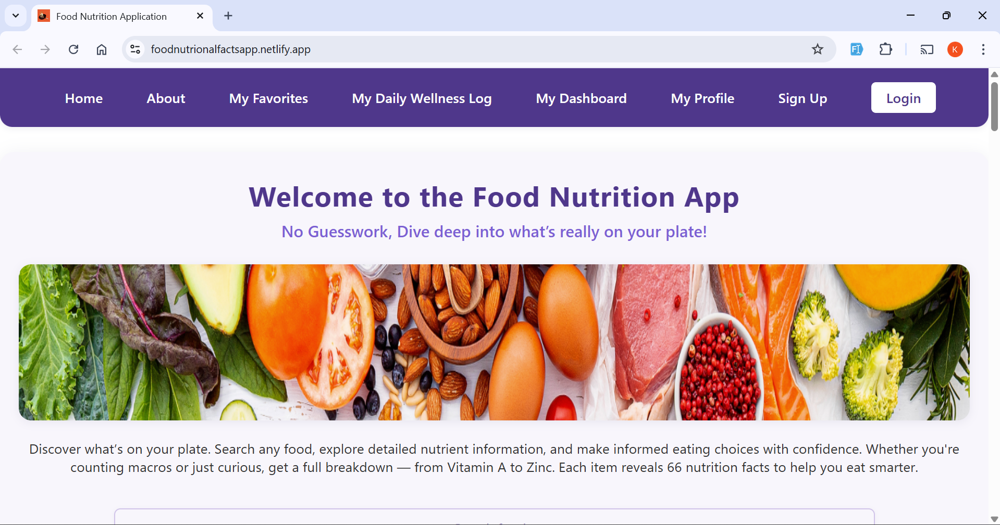
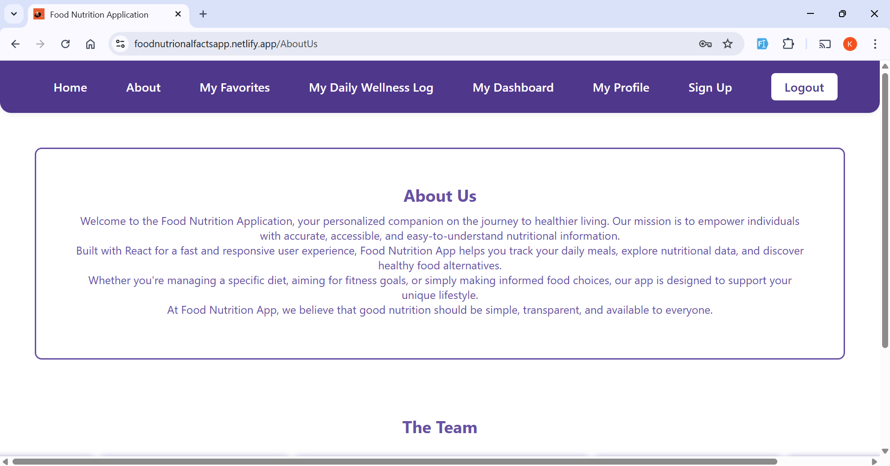
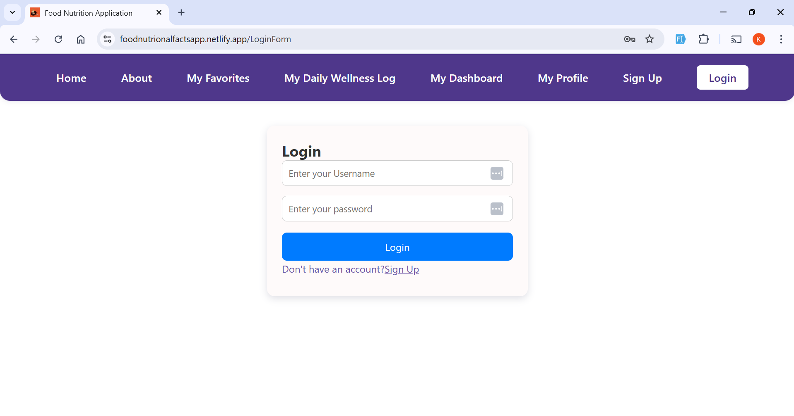
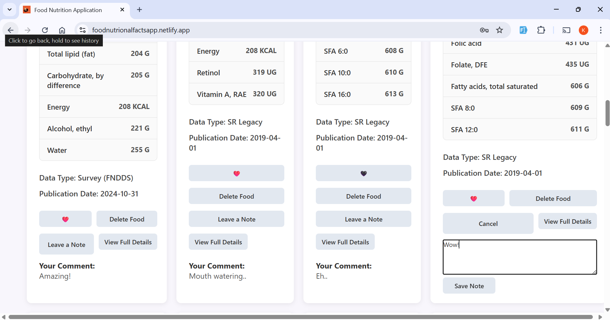
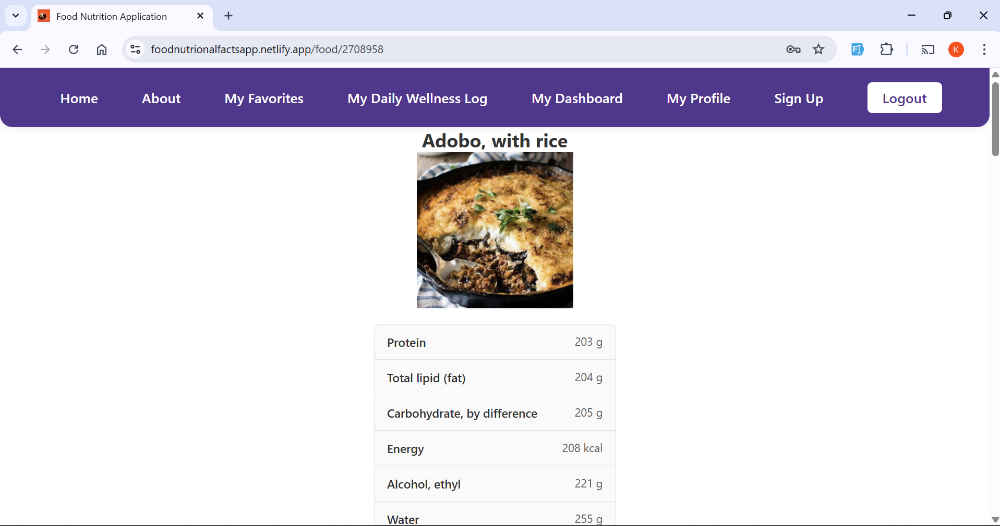
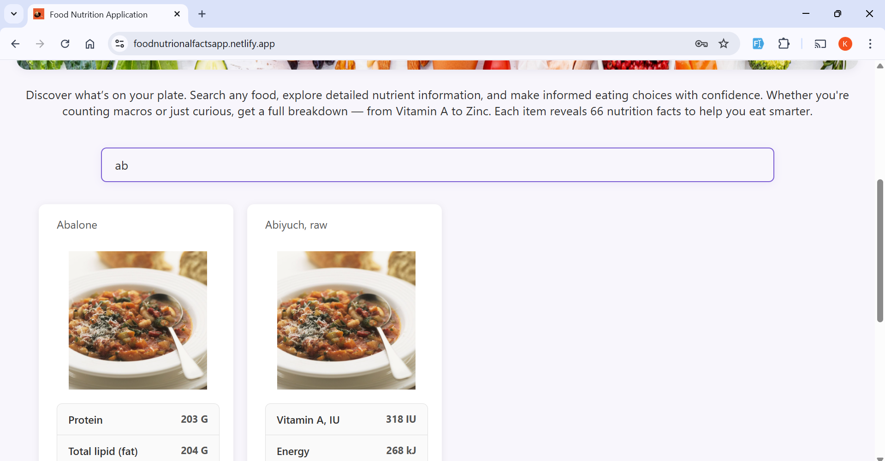
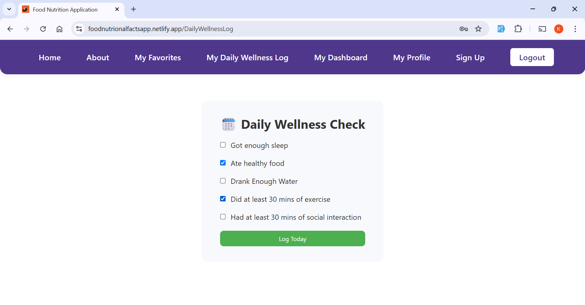

# 🍲 FOOD NUTRITION APPLICATION
Welcome to our Food Nutrition Application. Built with React for a fast and responsive user experience, Food Nutrition App helps you track your daily meals, explore nutritional data, and discover healthy food alternatives. At Food Nutrition App, we believe that good nutrition should be simple, transparent, and available to everyone.

## 🚀 Features 
- Browse a list of foods with their nutrition details. `/Home `
- Search foods `/Search` 
- User is able to interact with the developers of the project through the contacts provided. `/AboutUs`
- User authentication (for protected routes) `/Login` 
- Ability to save favorite foods (protected). `/Favorite` 
- Add personal notes to foods. 
- Edit profile/settings (protected). `/Profile` 
- Ability to see detailed nutritional info a specific food selected. `/FoodDetail` 
- Ability to delete a food from favorites(protected) 
- User can view a dashboard that contains a summary of their personal inputs. `/MyDashboard`
- User can add daily wellness check log that checks if they've had enough sleep, ate healthy food, drank enough water, did at least 30 minutes of exercise and had at least 30 minutes of social interaction. `/DailyWellnessLog`

## Repository Setup
- **Fork** and **Clone** the Repository
```
git clone <repository link>
```
- `cd` into the repository folder
```
cd <repo-name>
```
- `npm install` to get the dependencies for the project
```
npm install
```
- `npm run dev` to display the project on a browser using a recommended port
```
npm run dev
```
## 🗂️ File Structure
```
📦 group-10-project
├─ public
│  ├─ desktop.png
│  ├─ favicon.png
│  └─ vite.svg
├─ src
│  ├─ assets
│  │  ├─ css
│  │  │  └─ index.css
│  │  └─ images
│  │     ├─ about-us.png
│  │     ├─ daily-wellness.png
│  │     ├─ full-details.ng
│  │     ├─ login-page.png
│  │     ├─ notes-feature.png
│  │     ├─ search-feature.png
│  │     └─ homepage.png
│  ├─ components
│  │  ├─ AboutUs.jsx
│  │  ├─ App.jsx
│  │  ├─ AuthContext.jsx
│  │  ├─ DailyWellnessLog.jsx
│  │  ├─ Food.jsx
│  │  ├─ FoodDetails.jsx
│  │  ├─ FoodList.jsx
│  │  ├─ Home.jsx
│  │  ├─ LoginForm.jsx
│  │  ├─ MyDashboard.jsx
│  │  ├─ MyFavorites.jsx
│  │  ├─ MyProfile.jsx
│  │  ├─ NavBar.jsx
│  │  ├─ PrivateRoute.jsx
│  │  ├─ Search.jsx
│  │  └─ SignUp.jsx
│  └─ main.jsx
├─ .gitignore
├─ eslint.config.js
├─ index.html
├─ LICENSE
├─ package-lock.json
├─ package.json
├─ README.md
└─ vite.config.js
```

## 🛠️ Tech Stack
- **Frontend:** React (Functional Components, Hooks and Routes)
- **Styling:** Basic CSS
- **APIs:** [FoodDataFromUSDA](https://api.nal.usda.gov/fdc/v1/foods/list?api_key=8Rv57kYxBTe6DURXfAZu8DBKcol1W0hpsrc7d1xJ), [RandomFoodImages](https://via.placeholder.com/500x600?text=No+Image)

## 📸 Screenshots








## 📄 License
[MIT License](./LICENSE)

## ✅ Future Improvements
- Feature to add a new food item

## 🧑🏿‍🤝‍🧑🏿 Contributors
 - [AntonyOmondi](https://github.com/AntonyOmondi)
 - [jkininga](https://github.com/jkininga)
 - [Gregg-K](https://github.com/Gregg-K)
 - [KarlMunyoro](https://github.com/KarlMunyoro)
- [Fortune]()

## Acknowledgement
- Moringa School
- Technical Mentors:-
    - Ian Okumu
    - Charles Swaleh
- Every Group 10 Member (Contributors)

## Link
- The app can be accessed through the following link : 
<a href="https://foodnutrionalfactsapp.netlify.app/">Food Nutritional Facts</a>

- We hope you enjoy using the app!